# Create Mod Production Lines

## Compact Recipes

### Dirt
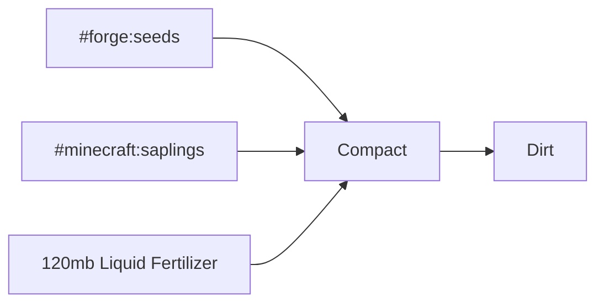

## Crush Recipes

### Crushed Deepslate
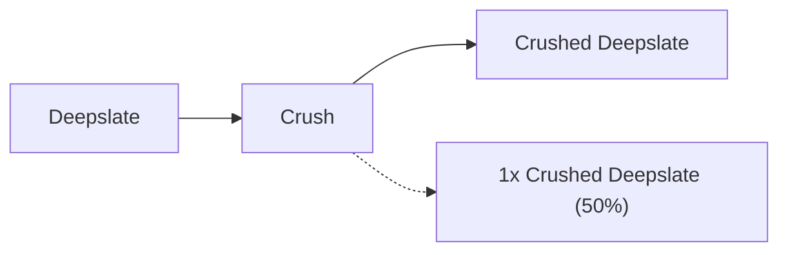

### Sturdy Shards
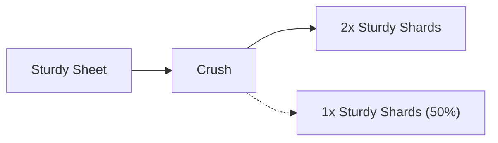

## Distill Recipes

### Water
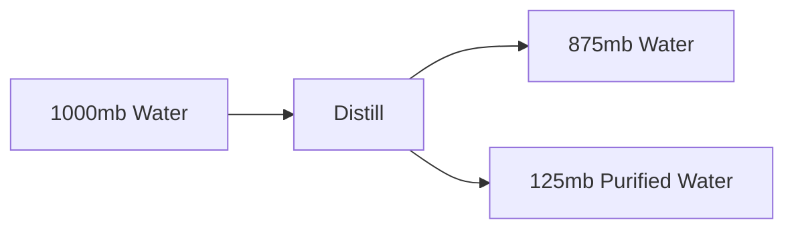

## Fill Recipes

### Brass Casing
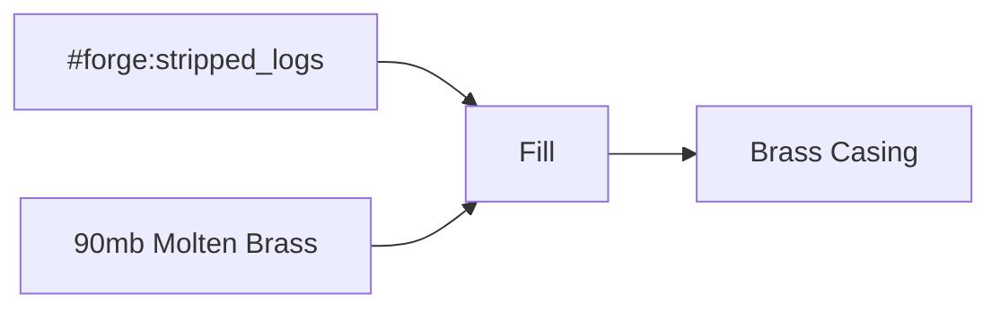

### Glowstone Dust
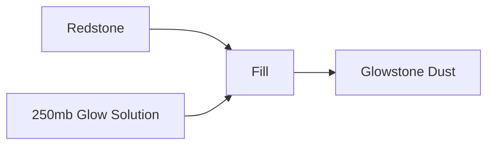

## Mix Recipes

### Crystalline Acid
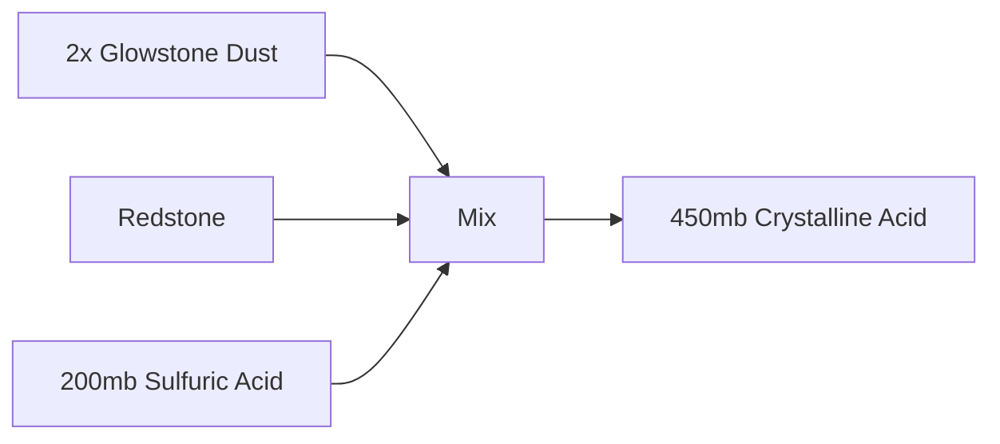

### Enriched Water
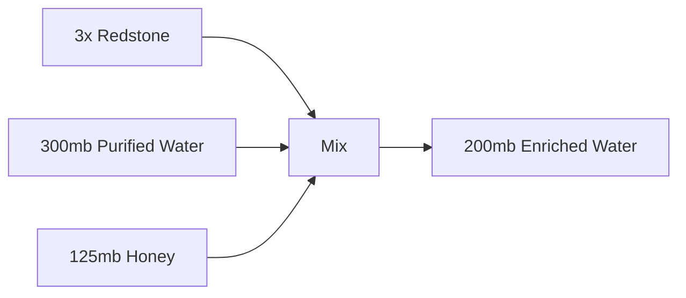

### Glow Solution
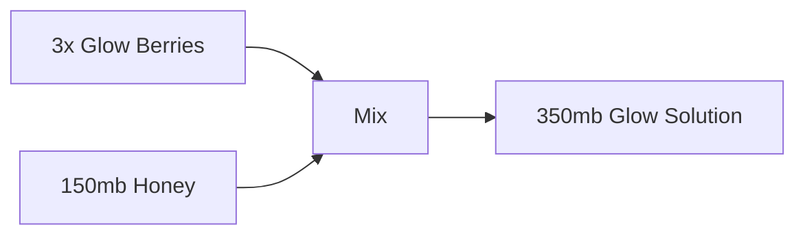

### Gold Solution
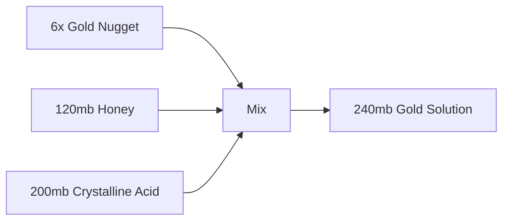

### Liquid Garnish
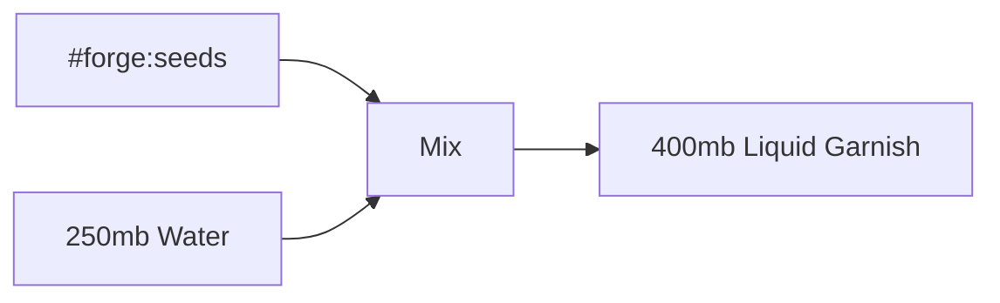

### Nitrogen


### Ochrum
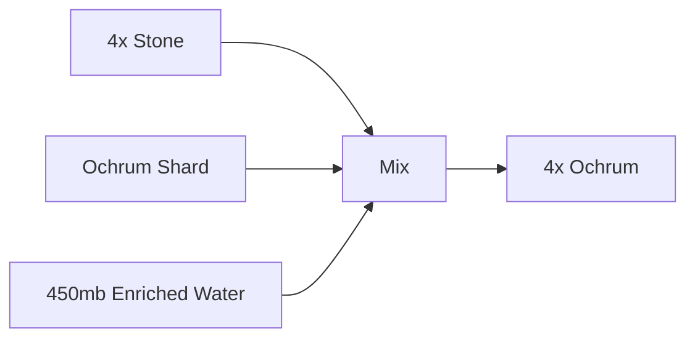

### Volcanic Acid
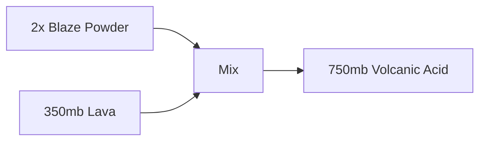

### Zinc Solution
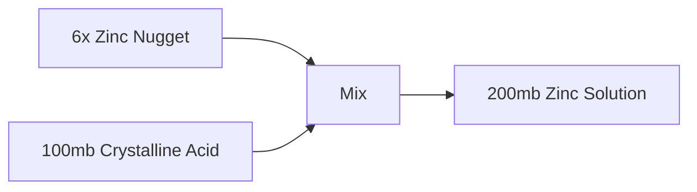

## Pressurize Recipes

### Asurine
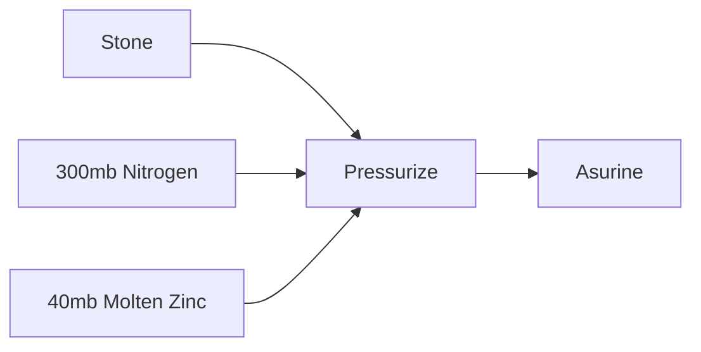

### Copper Sulfate
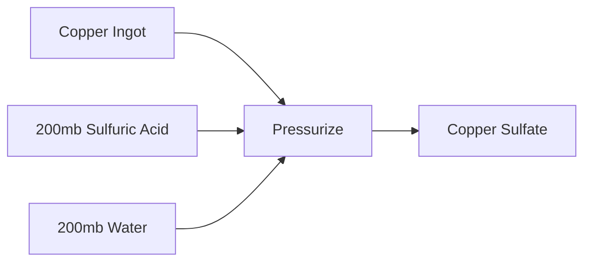

### Molten Zinc
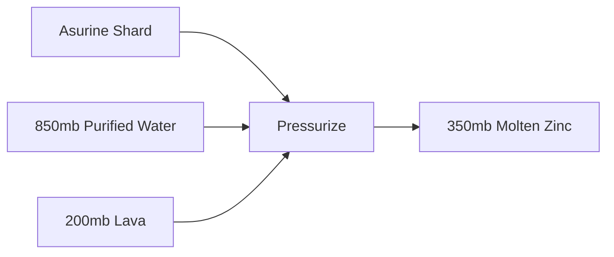

### Molten Refined Obsidian
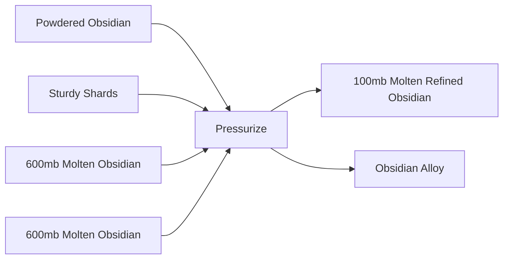

### Sulfur
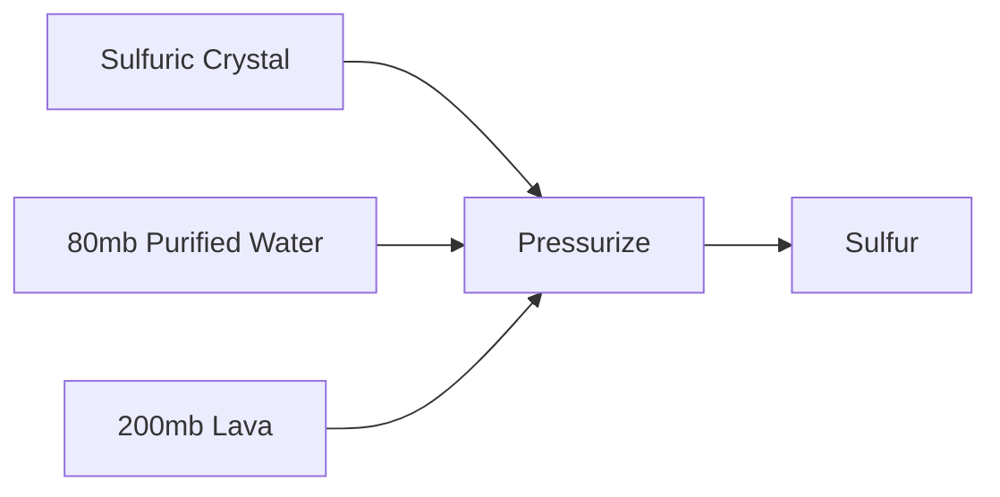

### Sulfuric Acid
```mermaid
graph LR
    in0["Nitrate Dust"] --> P
    f0["1000mb Water"] --> P
    f1["1000mb Sulfur Trioxide"] --> P
    P[Pressurize]
    P --> out0["1000mb Sulfuric Acid"]
```

### Zinc Sulfate
```mermaid
graph LR
    in0["Zinc Ingot"] --> P
    f0["200mb Sulfuric Acid"] --> P
    f1["200mb Water"] --> P
    P[Pressurize]
    P --> out0["Zinc Sulfate"]
```

## Sequence Recipes

### Asurine Shard
```mermaid
graph LR
    start["Obsidian Alloy"]
    F0["Filling"]
    start --> F0
    in0["150mb Crystalline Acid"] --> F0
    C1["Cutting"]
    F0 --> C1
    D2["Deploying"]
    C1 --> D2
    in2["Quartz"] --> D2
    F3["Filling"]
    D2 --> F3
    in3["250mb Zinc Solution"] --> F3
    P4["Pressing"]
    F3 --> P4
    P4 -.-> out0["3x Asurine Shard (75%)"]
    P4 -.-> out1["2x Asurine Shard (20%)"]
    P4 -.-> out2["Light Blue Dye (5%)"]
```

### Calcite Catalyst
```mermaid
graph LR
    subgraph Metadata
        loops["2 Loops"]
    end
    start["Limestone Shard"]
    P0["Pressing"]
    start --> P0
    F1["Filling"]
    P0 --> F1
    in1["200mb Liquid Garnish"] --> F1
    F2["Filling"]
    F1 --> F2
    in2["180mb Water"] --> F2
    F2 --> out0["Calcite Catalyst"]
```

### Deepslate Alloy
```mermaid
graph LR
    start["Andesite Alloy"]
    P0["Pressing"]
    start --> P0
    D1["Deploying"]
    P0 --> D1
    in1["Crushed Deepslate"] --> D1
    D2["Deploying"]
    D1 --> D2
    in2["Crushed Deepslate"] --> D2
    D2 --> out0["Deepslate Alloy"]
```

### Lapis Lazuli
```mermaid
graph LR
    start["Lapis Lazuli Catalyst"]
    C0["Cutting"]
    start --> C0
    D1["Deploying"]
    C0 --> D1
    in1["Quartz"] --> D1
    F2["Filling"]
    D1 --> F2
    in2["350mb Water"] --> F2
    P3["Pressing"]
    F2 --> P3
    P3 -.-> out0["2x Lapis Lazuli (95%)"]
    P3 -.-> out1["2x Blue Dye (5%)"]
```

### Lapis Lazuli Catalyst
```mermaid
graph LR
    subgraph Metadata
        loops["2 Loops"]
    end
    start["Stone"]
    F0["Filling"]
    start --> F0
    C1["Cutting"]
    F0 --> C1
    P2["Pressing"]
    C1 --> P2
    D3["Deploying"]
    P2 --> D3
    D3 -.-> out0["4x Lapis Lazuli Catalyst (75%)"]
    D3 -.-> out1["3x Lapis Lazuli Catalyst (25%)"]
```

### Netherrack
```mermaid
graph LR
    start["Cobblestone"]
    D0["Deploying"]
    start --> D0
    in0["Nether Wart"] --> D0
    F1["Filling"]
    D0 --> F1
    in1["60mb Fertilizer"] --> F1
    F2["Filling"]
    F1 --> F2
    in2["125mb Lava"] --> F2
    F2 --> out0["Netherrack"]
```

### Ochrum Shard
```mermaid
graph LR
    start["Obsidian Alloy"]
    D0["Deploying"]
    start --> D0
    in0["Gold Nugget"] --> D0
    F1["Filling"]
    D0 --> F1
    in1["50mb Molten Slag"] --> F1
    C2["Cutting"]
    F1 --> C2
    F3["Filling"]
    C2 --> F3
    in3["150mb Gold Solution"] --> F3
    F4["Filling"]
    F3 --> F4
    in4["250mb Lava"] --> F4
    F4 -.-> out0["3x Ochrum Shard (75%)"]
    F4 -.-> out1["2x Ochrum Shard (20%)"]
    F4 -.-> out2["Yellow Dye (5%)"]
```

### Sulfuric Crystal
```mermaid
graph LR
    start["Obsidian Alloy"]
    F0["Filling"]
    start --> F0
    in0["175mb Volcanic Acid"] --> F0
    F1["Filling"]
    F0 --> F1
    in1["250mb Sulfuric Solution"] --> F1
    C2["Cutting"]
    F1 --> C2
    D3["Deploying"]
    C2 --> D3
    in3["Quartz"] --> D3
    P4["Pressing"]
    D3 --> P4
    P4 -.-> out0["2x Sulfuric Crystal (90%)"]
    P4 -.-> out1["Sulfuric Crystal (10%)"]
```

## Vacuum Recipes

### Water
```mermaid
graph LR
    f0["15mb Purified Water"] --> V
    f1["150mb Water"] --> V
    V[Vacuum]
    V --> out0["145mb Water"]
    V --> out1["15mb Purified Water"]
```

### Sulfuric Solution
```mermaid
graph LR
    in0["Sulfur Dust"] --> V
    f0["200mb Lava"] --> V
    f1["75mb Glow Solution"] --> V
    V[Vacuum]
    V --> out0["300mb Sulfuric Solution"]
```

